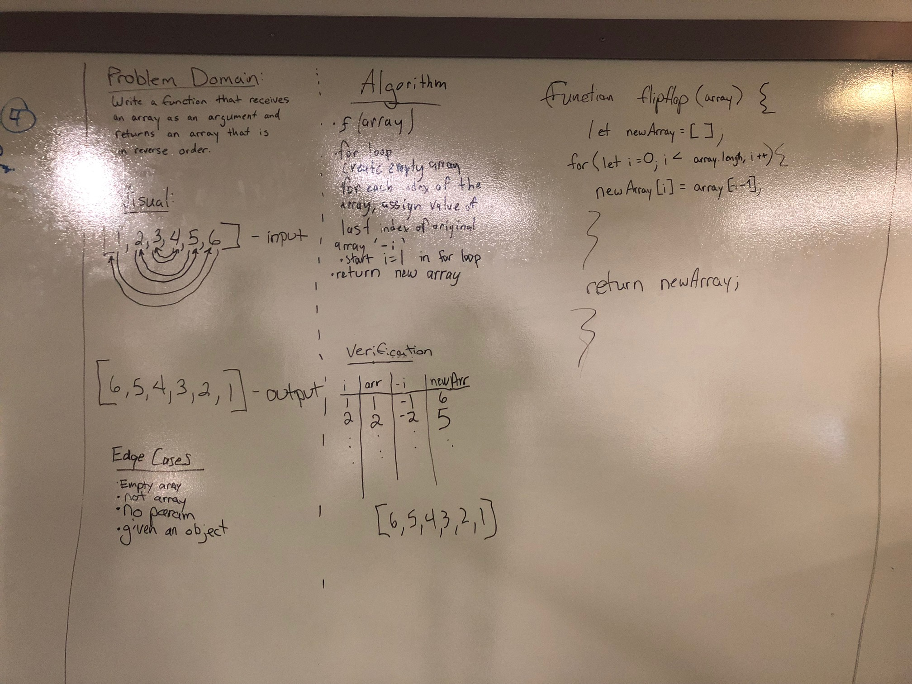

# Reverse an Array
Write a function that takes in an array and reverses it. Returning that new array.

## Challenge
Complete this challenge without using native methods to your language.

## Approach & Efficiency
We approached this problem thinking that we would declare the new arrays value at the appropriate index when we iterated through. However, our original solution of accessing an arrays last postion with a negative index was unsuccessful, so we utilized the arrays length modified during itiration to give us our target index.

## Solution

