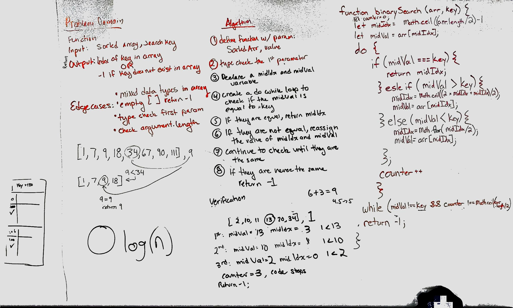

# Binary Search
A binary search will take in a data set and search by half for each of the passes. Resulting in a only half of the data set needing to be processed in order to locate the desired value.

## Challenge
Write a formula that takes in two parameters. The first is a sorted array, and the second is value. Return the index position of the value within the sorted array. If not located, return -1.

## Approach & Efficiency
We approached this problem knowing that we needed to locate the midpoint index and make a comparison with the value of that index against our input value. Depending on the relation of this comparison we redifined the midpoint between an edge of the array (start or finish) and our current midpoint. Repeating this process as many times are required to have the midpoint value equal the input value.

## Solution

