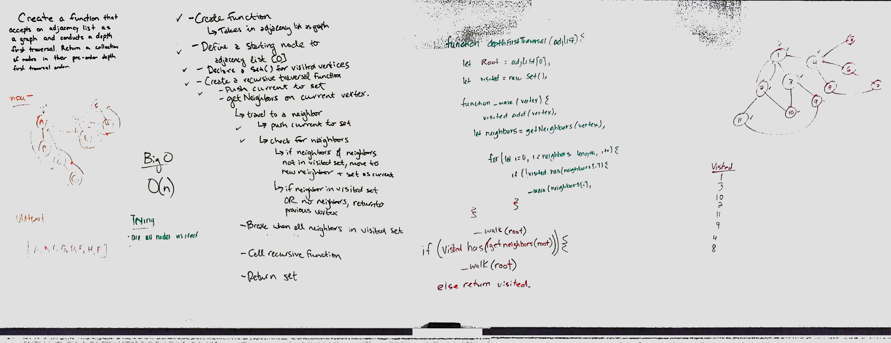

# Depth First of a Graph

## Challenge
Write a function that takes in an adjacency list as a graph. Write a function that traverses the graph depth first and returns a collection of vertex.

## Approach & Efficiency
We used a recursive function, and it isn't currently working. I think we are close to solving the issue, but need more time to work out bugs.

Efficiency is O(n). This is because the function tracks visited vertex.

## Solution

