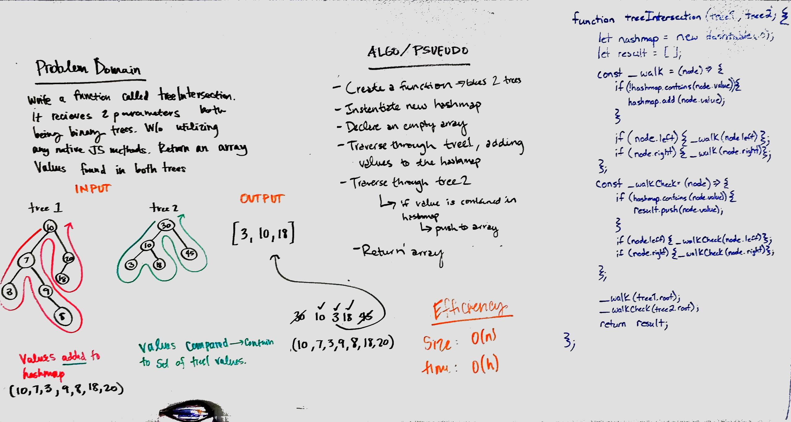

# Hashtables

## Challenge 2 - Intersection of Trees
Write a function that takes in a lengthy string and returns the first repeated word in that string.

## Approach & Efficiency
We utilized a hashmap to assist in processing the two trees. We use depth first traversal on the first tree to add every non-duplicate value into the hashtable, and than use pre-order depth first traversal on the second tree to check if a value was already encountered. If it was repeated we added it to an array and returned the array.

O(n) for space and time

### Solution
