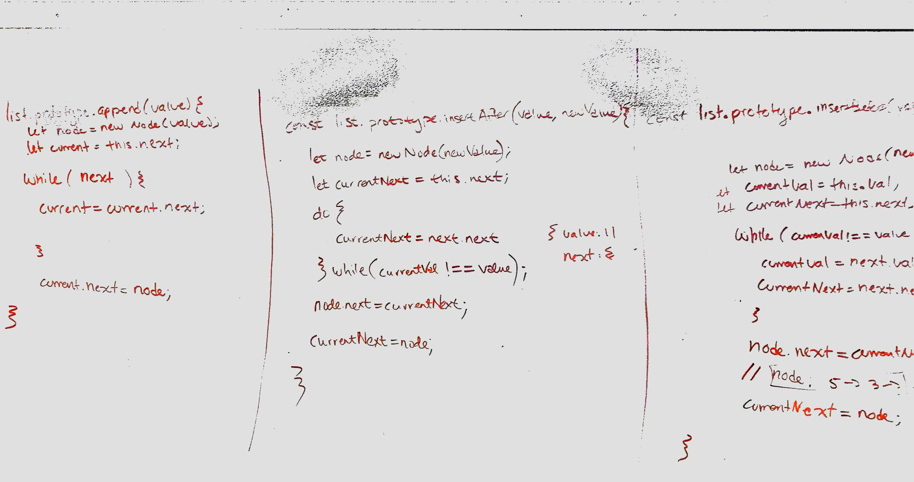
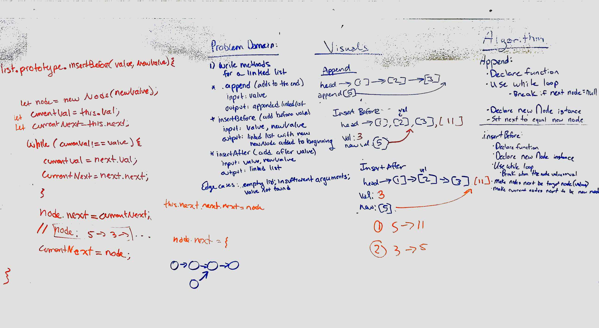
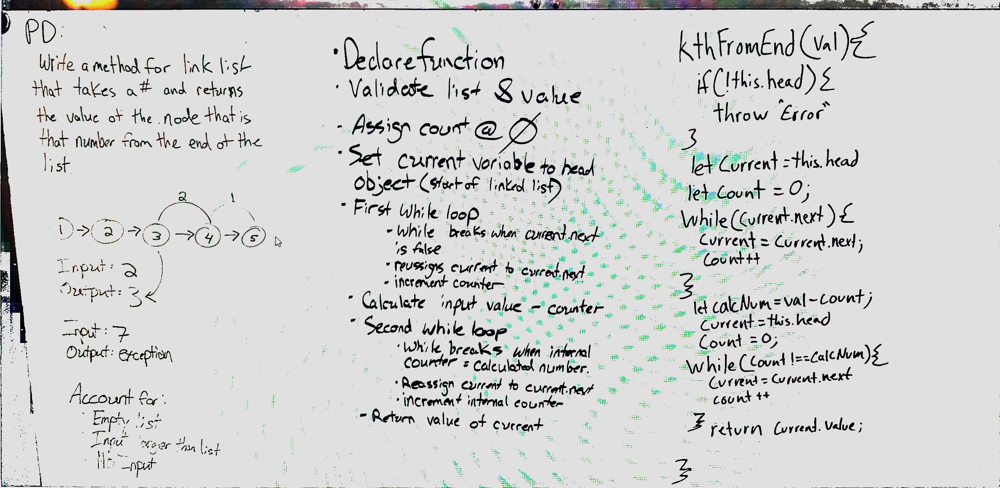
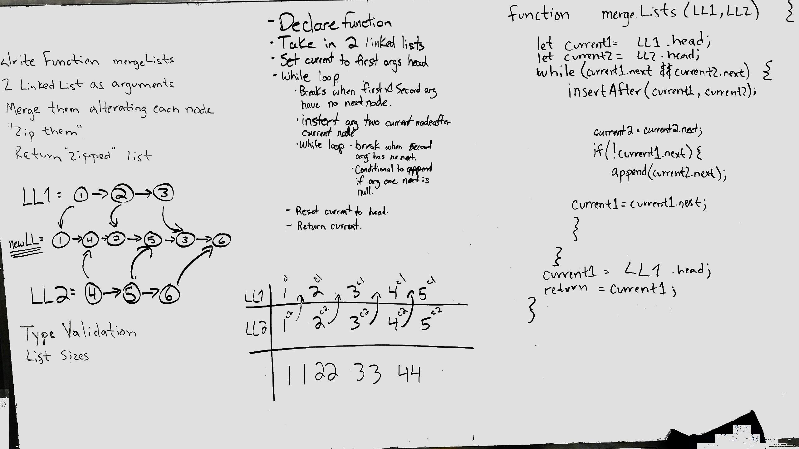

# Singly Linked List
A linked list data structure with each node referencing the next node in the sequence.

## Challenge 1

### Challenge
Create a Linked List data structure with methods for adding, inserting, printing values, and includes.

### Approach & Efficiency
Time: O(n)
Space: O(1)

The approach to this task is focused on the relationship that each node has to another. Each node references just one other node that is the next in the sequence until it references null, at that point the list is complete.

<!-- TODO: Print Method, and Includes Method -->

## Challenge 2

### Challenge
Create 3 new methods for our linked list. 1) append a node to the end, 2) insert a node before another node with a given value, 3) insert a node after another node with a given value.

### Approach & Efficiency

### Solution

<!-- write tests for argument.length validation and bad argument -->

## Challenge 3

### Challenge
Create a method for linked list that takes in a number and returns the value of the node that is that input from the end.

### Approach & Efficiency
I approached this challenge thinking that I would first need to find a length for the list, and then I would be able to traverse the list until I reach the designated node. This requires traversal of the node 1 time completely, and a second time partially (possibly completely) in order to find the designated node.

### Solution

## Challenge 4

### Challenge
Create a method for linked list that takes in two lists and merges them while alternating nodes.

### Approach & Efficiency
The first approach we took to this challenge involved nested while loops, however, we quickly realized that it wasn't needed. We established a variable for the 'current' of each list, and the 'next' of each list. As we iterated through both lists we reassigned the next property of the second lists nodes to the appropriate places in the first list. I believe time is O(n) and space is O(1), however, space may be O(n);

### Solution
