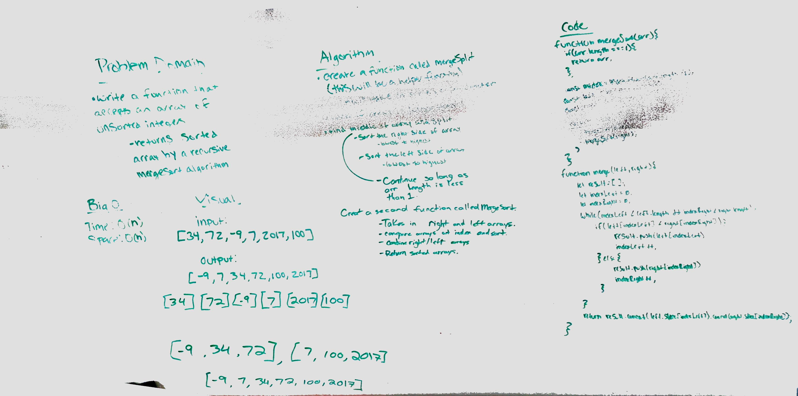

# Mergesort

## Challenge
Take in an array of integers that is unsorted. Using merge sort, recursively to reorder the integers from least to greatest.

## Approach & Efficiency
After research we created two functions. One which breaks apart of the array and calls another function and itself. The second function creates a result array by comparing the values at different indexes of the broken up arrays.

Attributions: Alexander Kondov

## Solution
