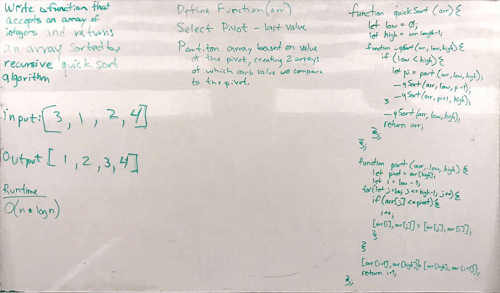

# Mergesort

## Challenge
Take in an array of integers that is unsorted. Using quick sort algorithm recursively to reorder the integers from least to greatest.

## Approach & Efficiency
After research we created two functions. One which breaks apart of the array at a pivot point. The pivot point is arbitrary, but we have written it out as the last index in the array. The second function creates a result array by comparing the values as it process the callstack.

## Solution
