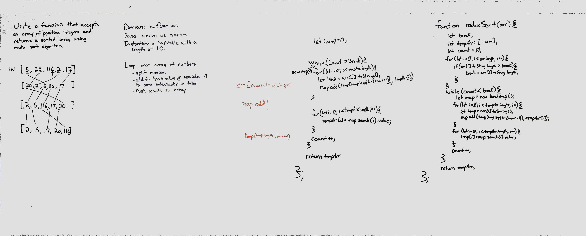

# Radix Sort

## Challenge
Take in an array of positive integers that is unsorted. Using radix sort algorithm reorder the integers from least to greatest.

## Approach & Efficiency
This one was a doozy. We did quite a bit of research and looked up visuals on how this sort works. After thinking it through we began to write code. We started with a help function to determine the greatest digit length, and eventually refactored it all into on while loop. We made some assumptions on the Hashtable that it would have a linked list with a removal method.

All in all I have no real idea what the efficiency would be. I think it is O(n), but am not sure.

## Solution
